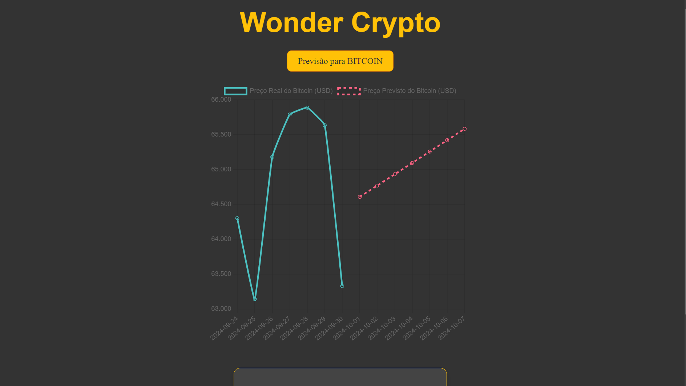

# WONDER CRYPTO 🪙

## Descrição

A Wonder Crypto é um sistema de auxílio à tomada de decisões para investimento em cripto ativos. Através de IA e aprendizado de máquina, o sistema é capaz de analisar o histórico de preços de cripto ativos e indicar o melhor momento para compra e venda de determinados ativos.

No momento, o único criptoativo analisado pela solução é o Bitcoin. Essa análise é feita por um modelo de RNN (Rede Neural Recorrente), que foi pré-treinado com dados históricos de preços do Bitcoin e, por isso, é capaz de inferir estimativas dos preços do Bitcoin relativos à próxima semana do dia atual. As predições realizadas pelo modelo são apresentadas na forma de um gráfico presente na interface do frontend (React) do sistema, que também conta com um backend (Fast Api) e um data lake (Minio) dockerizados.

Outra funcionalidade disponível na solução é a de upload de um novo arquivo ``.h5`` para realização da predição pelo modelo. O usuário pode fazer esse upload através da própria interface do sistema, que possbilita o envio de um arquivo local que é salvo no datalake da solução.



> :bulb: Também é possível verificar o processo de exploração e tratamento de dados no Jupyter Notebook presente no repositório em `../data-exploration/data_exploration.ipy`

## Pré requisitos

- Git instalado e configurado
- Docker instalado e configurado
- WSL instalado e configurado (Windows)

## Instalação e execução

### Linux

1. Numa janela de terminal aberta em seu diretório de preferência, clone o repositório com o seguinte comando:

```bash
git clone git@github.com:RaiDeOliveira/wonder-crypto.git
```

2. Inicialize o build e a execução do docker:

```bash
cd wonder-crypto/src
docker-compose up --build
```

3. Acesse `localhost:3000` para acessar a interface da solução.


### Windows

1. Numa janela de terminal aberta em seu diretório de preferência, clone o repositório com o seguinte comando:

```bash
git clone git@github.com:RaiDeOliveira/wonder-crypto.git
```

2. Na mesma janela de comando, inicialize o WSL:

```bash
cd wonder-crypto/src
wsl
```

3. Inicialize seu Docker Desktop

4. Inicialize o build e a execução do docker:

```bash
docker-compose up --build
```

5. Acesse `localhost:3000` para acessar a interface da solução.
